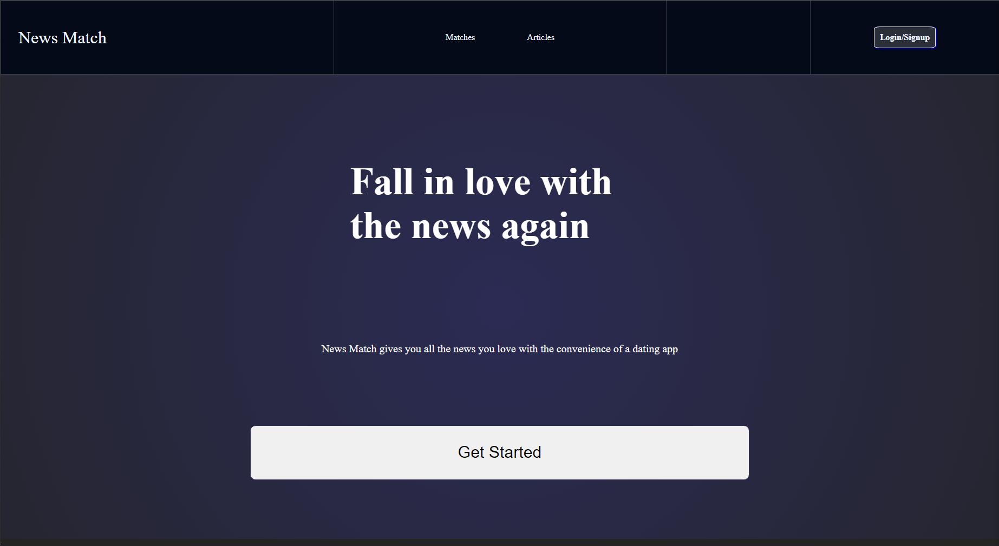

# News Match
## A. Description
> [Deployed Link](https://news-match.vercel.app/)

News Match is a mobile responsive full-stack web application that allows users to sift through news articles with the user experience of swiping through a dating app like Tinder. It takes full advantage of Nextjs's ability to pre-fetch and cache data before the user comes to the site to create an article-scrolling experience that has 0 loading screens.
   
 
## B. Images
>### Using the Application



>### On Mobile


## C. Technologies Used
### Front End
```
1. React
3. Nextjs
3. HTML
4. CSS
5. react-popup
```
### Back End
```
1. Express
2. Node
```
### Database
```
1. MongoDB
```
### Third-Party API
```
1. Currents API
```
### Authentication
```
1. Auth0
```
### Cloud Based Services
```
1. Heroku
2. Vercel
```
### Planning and Organization
```
1. Trello
2. Lucidchart
3. Excalidraw
```


## D. Getting Started
[News Match](https://news-match.vercel.app/)
1) ### Landing Page 
	- On the landing page, you'll be greeted with some marketing text and two options to really start navigating: Signing In and clicking 'Get Started'. For our purposes, let's click 'Get Started'
2) ### Articles Page
	- Clicking 'Get Started' should take you to the articles page. You'll likely see an image, a headline/title and description of an article. Clicking the title/headline of an article will take you to that article in a new tab. 
    - There will also be a left arrow, a right arrow and a down arrow. Clicking either the left or the right arrow will allow you to switch articles. If you are signed in, clicking the down arrow will add the shown article to your matches. If you are not signed in, you will be redirected to the sign in page.
3) ### Matches Page
    - Once you are signed in and have added a few articles to your matches, you can click the 'Matches' link in the main menu to see your matches. Each article will appear on this page with its title and description, clicking any of the articles will take you to the article in a new tab.

[Trello](https://trello.com/b/hHe1W5VM/p4-planning)


## E. Next Steps
```
As a User, I don't to see articles I've already put into my list
```			